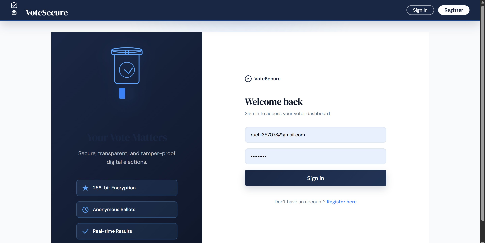
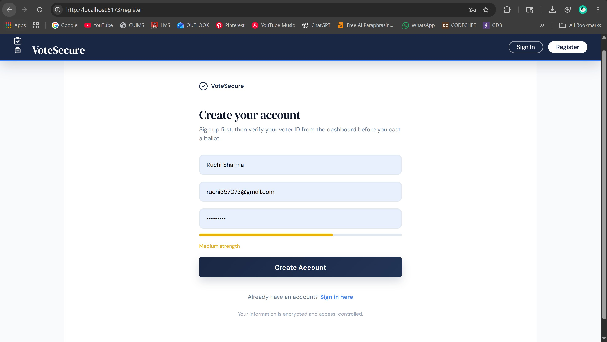
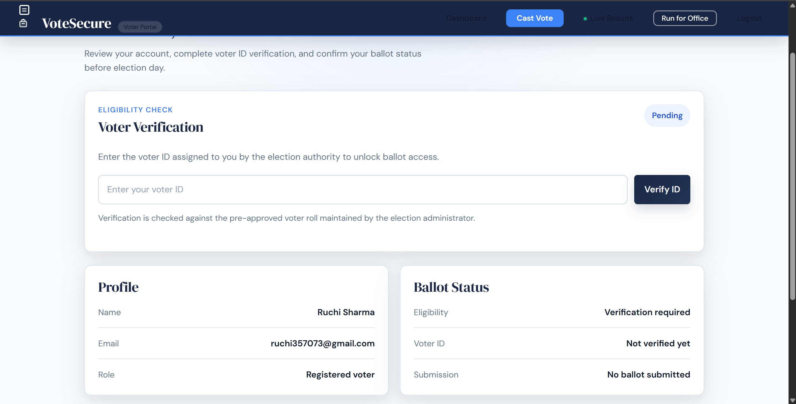
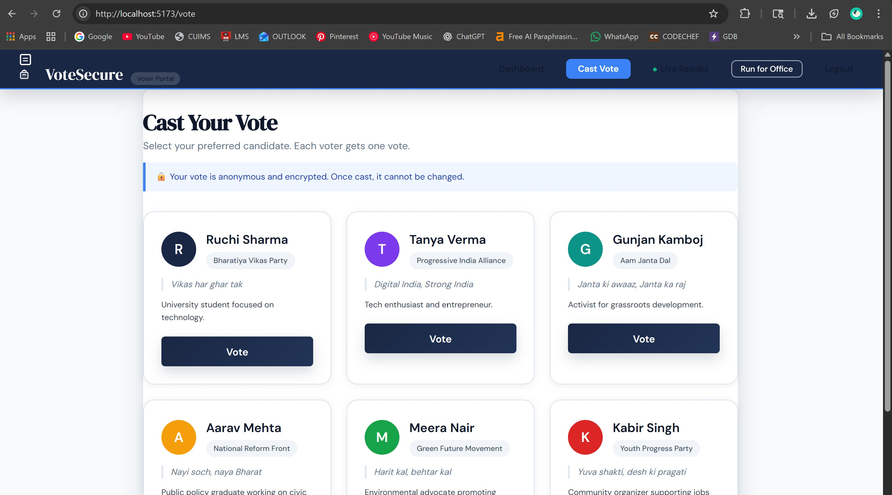
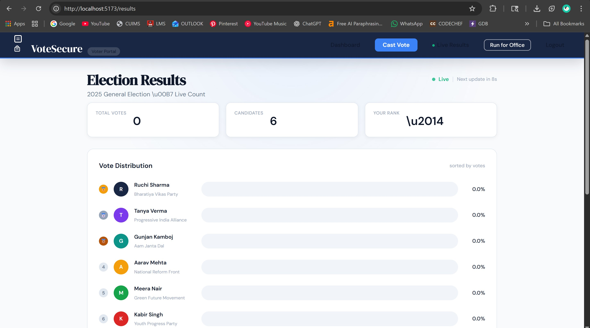
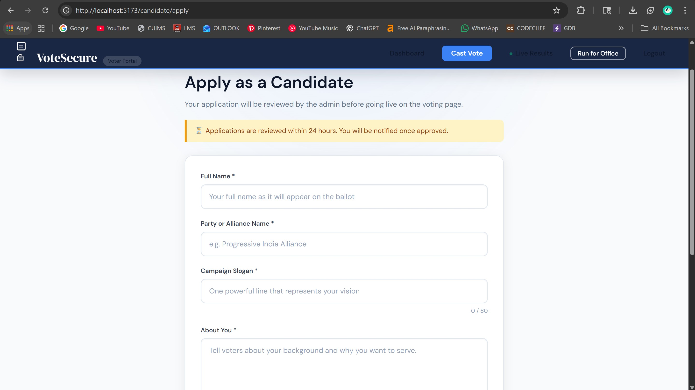

# VoteSecure-Online-Voting-System   
## Project Description
The Online Voting System is a web application that allows users to register, log in, and vote for candidates in an election. The system includes both a frontend and a backend, providing a complete solution for managing elections online.

## Features
- User registration and login
- Admin dashboard for managing voters and candidates
- Voter dashboard for viewing profile and voting
- Real-time vote counting and results display
- Secure authentication using JWT tokens 

## Technologies Used
- Frontend: React, Vite, React Router
- Backend: Spring Boot, JPA, PostgreSQL, JWT

## Setup Instructions

### Backend Setup
1. Install PostgreSQL:
   - Download from [https://www.postgresql.org/download/windows/](https://www.postgresql.org/download/windows/)
   - Install with default settings (port 5432, user `postgres`, set a password)

2. Navigate to backend directory:
   ```bash
   cd voting-spring
   ```

3. Configure the database:
   - Create a PostgreSQL database named `votesecure_system`:
     ```sql
     CREATE DATABASE votesecure_system;
     ```
   - Update `src/main/resources/application.properties`:
     ```
     spring.datasource.url=jdbc:postgresql://localhost:5432/votesecure_system
     spring.datasource.username=postgres
     spring.datasource.password=your_password
     spring.datasource.driver-class-name=org.postgresql.Driver
     spring.jpa.hibernate.ddl-auto=update
     spring.jpa.database-platform=org.hibernate.dialect.PostgreSQLDialect
     ```
   - Add PostgreSQL driver to `pom.xml` if missing:
     ```xml
     <dependency>
         <groupId>org.postgresql</groupId>
         <artifactId>postgresql</artifactId>
         <scope>runtime</scope>
     </dependency>
     ```

4. Build and run:
   ```bash
   mvnw spring-boot:run
   ```

### Frontend Setup
1. Navigate to frontend directory:
   ```bash
   cd frontend/votesecure-frontend
   ```

2. Install dependencies:
   ```bash
   npm install
   ```

3. Run the frontend:
   ```bash
   npm run dev
   ```

## Backend API Endpoints

### Voter Endpoints
- `POST /voters/register`: Register a new voter
- `POST /voters/login`: Login a voter and issue a JWT token
- `GET /voters/me`: Get logged-in voter details
- `PUT /voters/{id}`: Update voter details

### Admin Endpoints
- `GET /admin/voters`: Get all voters
- `PUT /admin/voters/{id}`: Update voter details
- `DELETE /admin/voters/{id}`: Delete a voter
- `POST /admin/candidates`: Add a new candidate
- `PUT /admin/candidates/{id}`: Update candidate details
- `DELETE /admin/candidates/{id}`: Delete a candidate
- `GET /admin/results`: Get election results

### Candidate Endpoints
- `GET /candidates`: Get all candidates
- `POST /candidates/{id}/vote`: Vote for a candidate

## Frontend Structure
- `src/components`: Contains reusable components like `Header`, `HomePage`, `Table`, etc.
- `src/pages`: Contains page components like `LoginPage`, `RegisterPage`, `AdminDashboard`, `VoterDashboard`, etc.
- `src/styles`: Contains CSS files for styling the components and pages.

## Screenshots

### Login Page
Users can securely log into their voter or admin accounts using their credentials.  


### Registration Page
New voters can register by providing their details including name, email, phone, and address.  


### Voter Dashboard  
Voters can view their profile information, verification status, and available candidates to vote for.  


### Admin Dashboard
Administrators can manage voters, candidates, and view real-time election results from this centralized dashboard.  


### Vote Page
Voters select their preferred candidate from the list and cast their vote securely.  


### Results Page
Real-time election results showing vote counts for each candidate, updated live as votes are cast.  


### Candidate Application
Candidates can apply for election participation through this form (authority verification required).  


## Usage Instructions
1. Start backend (http://localhost:8080) and frontend (http://localhost:5173).
2. Register/login as voter/admin.
3. Manage voters/candidates from admin dashboard.
4. Voters can vote and view results.

## Contributing
We welcome contributions to the VoteSecure-Online-Voting-System project. To contribute, please follow these guidelines:
1. Fork the repository.
2. Create a new branch for your feature or bug fix.
3. Commit your changes and push them to your forked repository.
4. Create a pull request with a detailed description of your changes.

## Authors

- [Ruchi Sharma](https://github.com/ruchisharma05)
- Tanya Verma
- Gunjan Kamboj
